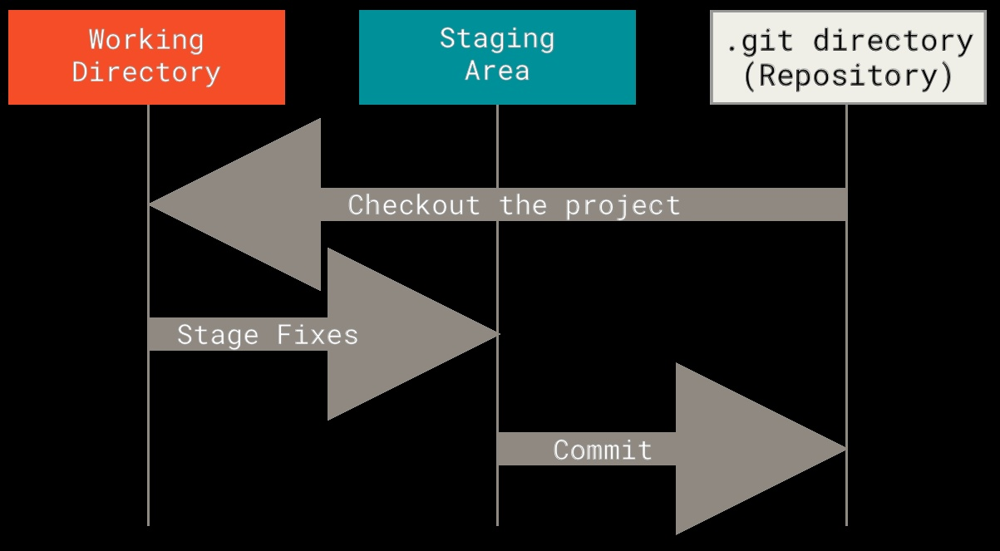

# What is Git?

## Snapshots, Not Differences

- The major difference between Git and any other VCS (Subversion and friends included) is the way Git thinks about its data.
- Conceptually, most other systems store information as a list of file-based changes.
- These other systems (CVS, Subversion, Perforce, Bazaar, and so on) think of the information they store as a set of files and the changes made to each file over time (this is commonly described as _delta-based_ version control).

## Git

- Storing data as changes to a base version of each file Git doesn't think of store its data this way.
- Instead, Git thinks of its data more like a series of snapshots of a miniature filesystem.
- With Git, every time you commit, or save the state of your project, Git basically takes a picture of what all your files look like at that moment and stores a reference to that snapshot.
- To be efficient, if files have not changed, Git doesn't store the file again, just a link to the previous identical file it has already stored.
- Git thinks about its data more like a **stream of snapshots**.

## Nearly Every Operation Is Local

- Most operations in Git need only local files and resources to operate. Generally no information is needed from another computer on your network.
- You have the entire history of the project right there on your local disk, most operations seem almost instantaneous.

## Git Has Integrity

- Everything in Git is checksummed before it is stored and is then referred to by that checksum.
- This means it's impossible to change the contents of any file or directory without Git knowing about it.

- This functionality is built into Git at the lowest levels and is integral to its philosofy.
- You can't lose information in transit or get file corruption without Git being able to detect it.

- The mechanism that Git uses ofr this checksumming is called a SHA-1 hash. This is a 40-character string composed of hexadecimal characters (0-9 and a-f) and calculated base on the contents of a file or directory structure in Git.
- A SHA-1 hash looks something like this:
  - `24b9da6552252987aa493b52f8696cd6d3b00373`
- Git stores everything in its database not by file name, but by the hash value of its contents.

## Git Generally Only Adds Data

- When you do actions in Git, nearly all of them only add data to the Git database.
- It is hard to get the system to do anything that is not undoable or to make it erase data in any way.
- As with any VCS, you can lose or mess up changes you haven't committed yet, but after you commit a snapshot into Git, it is very difficut to lose, especially if you regularly push your database to another repository.

## The Three States

- Git has three main states that your files can reside in:
  - modified
  - staged
  - committed

### Modified

- Modified means that you have changed the file but have not commited it to your database yet.

### Staged

- Staged means that you have marked a modified file in its current version to go into your next commit snapshot.

### Committed

- Committed means that the data is safely stored in your local database.

## Main sections of a git project

- the working tree
- the staging area
- the Git repository

### The Working Tree

- The working tree is a single checkout of one version of the project.
- These files are pulled out of the compressed database in the Git directory and placed on disk for you to use or modify

### The staging area

- The staging area is a file, generally contained in your Git directory, that stores information about what will go into your next commit.
- Its technical name in Git parlance is the "index", but the phrase "staging area" works just as well

### The Git Directory

- The Git repository is where Git stores the metadata and object database for your project.
- It is what is copied when you _clone_ a repository from another computer.

## Resources

- ["Pro Git" book, by Scott Chacon and Ben Straub](https://git-scm.com/book/en/v2)
